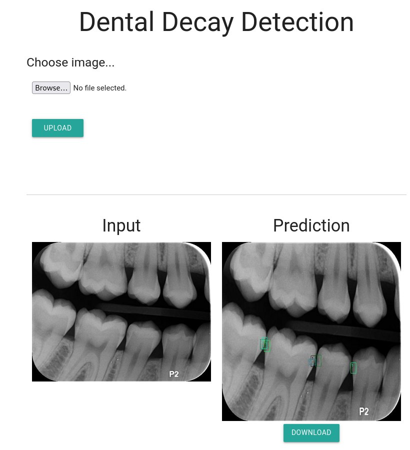

# Dental Decay Object Detection
This project trains a Faster R-CNN model to detect dental decay from bitewing images used in dentistry.  
## Features
* Uses Pytorch Lightning
* COCO dataset style standardized data input
* Faster R-CNN implementation
* Metrics
 * Calculation of mAP on test data implemented in model class
 * Manually calculating precision, recall, accuracy, specificity
  * True Positive, False Negative, ... values calculated for each class
  
## Purpose  
* main.py  
  * All in one file
   * In later larger projects, code will be separated into several files in order to be easier to read.
   * Contains dataset class, dataloader, model, training, etc.
   * Visualize function is used to visualize the prediction and ground truth
* convert_data_to_coco.py  
  * Converts out custom data from .nrrd (3dslicer output) to coco style JPEG and JSON.

## Usage
### Web GUI
1. Clone this repository
2. Run web.py
```bash
cd dental_decay_detection
python web.py
```
3. Go to http://127.0.0.1:33517
4. You can use the sample.jpg in images directory for testing, otherwise upload your image to see the prediction.
* The web interface **supports NRRD, JPG, and PNG** file formats.
### Training
1. Prepare a JSON and a directory for each of train, val, test. The directory contains images, and each JSON has COCO style annotation data of the images.
2. Use the main.py to train a model on your data. Checkpoint of the model will be saved in lightning_logs directory.
3. In the end, infer.py can be used for inference using the trained model checkpoint.
---
# Results
Currently trained on 847 images (697 train, 75 val, 75 test), the resulting mAP value on test dataset is 0.8251.
# Bugs
Precision, recall, accuracy, specificity calculation code is corrupt I think. Results are unusual. Fixing in the future...
# Demo

